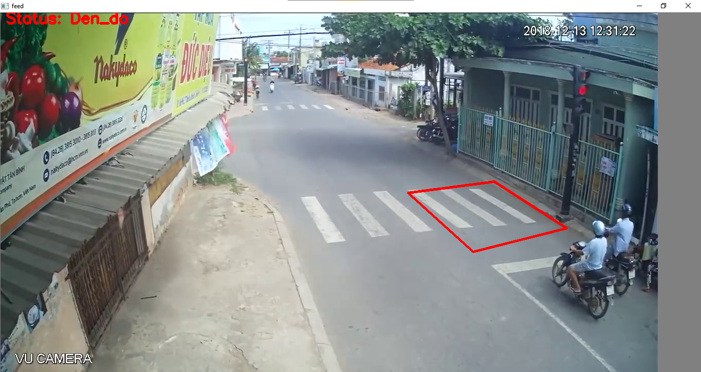

# ITS (Intelligent Traffic System) là gì?
[](https://github.com/xinchaothegioi31415/Red-Light-Detection)

ITS là hệ thống phân tích giao thông bao gồm các thành phần:
|  | Tên thành phần | Link |
| ------ | ------ | ------ |
| 1 | Phân tích lưu lượng giao thông | [link!](https://github.com/xinchaothegioi31415/ITS-Traffic-Capacity-Analyzation) |
| 2 | Nhận diện tai nạn giao thông | [link!](https://github.com/xinchaothegioi31415/Accident_Machine-learning) |
| 3 | Công nghệ phát hiện vượt đèn đỏ | here! |

>Hệ thống sử dụng công nghệ Machine Learning thông qua thư viện mã nguồn mở [Darkflow](https://github.com/thtrieu/darkflow) để huấn luyện cho máy tính.
>Ngoài ra, hệ thống còn sử dụng thư viện mã nguồn mở OpenCV để phân tích hình ảnh.

# Red Light Detection (Phát hiện vượt đèn đỏ)
**"Red Light Detection (Phát hiện vượt đèn đỏ)"** là một phần nhỏ trong hệ thống ITS, sử dụng thư viện mã nguồn mở OpenCV để xây dựng hệ thống tự động phát hiện phương tiện giao thông vượt đèn đỏ và ghi lại hình ảnh bản số xe của phương tiện giao thông đó.



# Dependencies
Python3, matplotlib (3.1.2), opencv-python (4.1.1.26), numpy (1.16.3)

# Hướng dẫn cài đặt
### Tải Python 3.7.3
> Bạn có thể tải Python 3.7.3 tại **[trang chính thức!](https://www.python.org/downloads/release/python-373/)**
### Clone project
Trước tiên, bạn cần clone dự án thông qua các cách:
- Thông qua Git:
```sh
$ git clone https://github.com/xinchaothegioi31415/Red-Light-Detection.git
```
- Hoặc tải xuống trực tiếp thông qua các cách sau:


### Cài đặt
1. Truy cập thư mục của dự án vừa clone ở trên, nhập **"cmd"** để mở *Command Prompt*.
2. Nhập dòng lệnh sau để cài đặt các thư viện cần thiết:
```sh
$ pip install -r requirement.txt
```

3. Hoặc cài đặt từng thư viện:
```sh
$ pip install matplotlib==3.1.2
$ pip install opencv-python==4.1.1.26
$ pip install numpy==1.16.3
```
### Build dự án
Sau khi cài đặt xong, bạn nhập vào ***Command Prompt*** dòng lệnh sau để tiến hành chạy hệ thống:
```sh
$ python detection.py
```

### Video hướng dẫn
[](https://youtu.be/oY1a0ED_FEk "VIDEO HƯỚNG DẪN")
***
Happy coding! 💻💻💻
